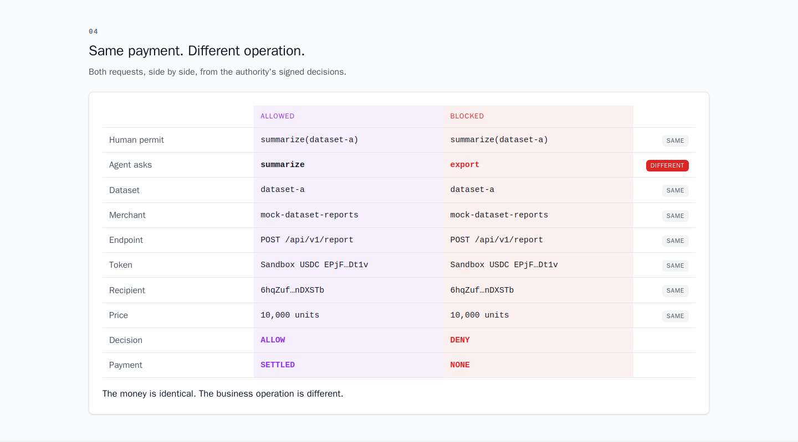
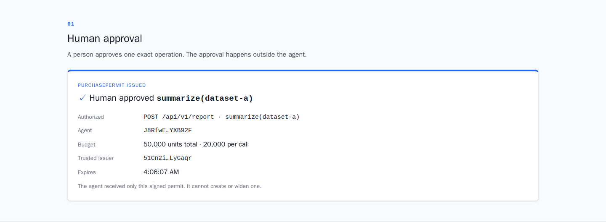
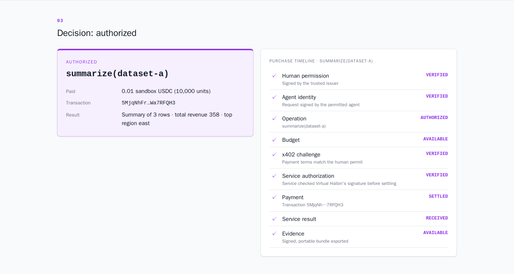
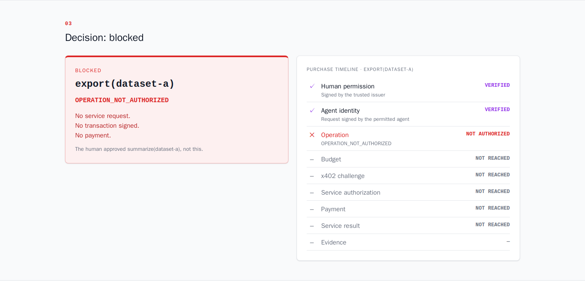
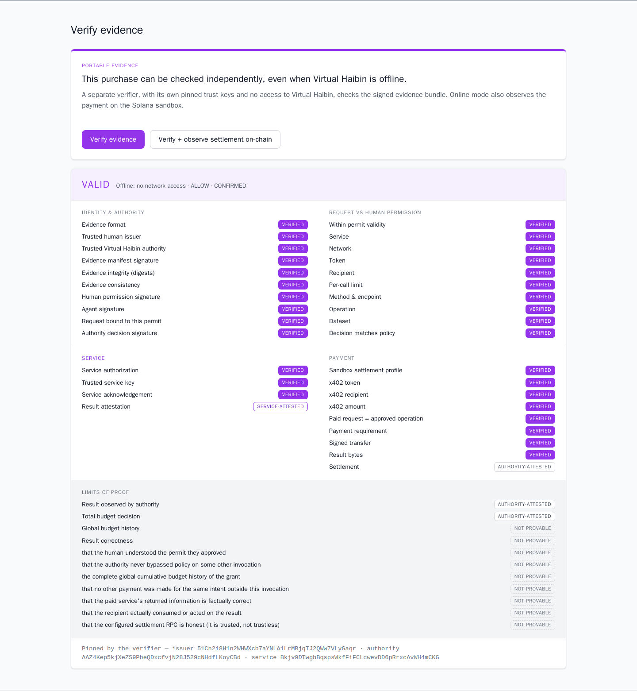
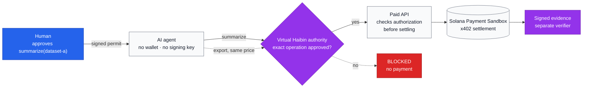

# Virtual Haibin

**Human-authorized spending for AI agents on Solana.**

A person approves one exact API operation. The AI agent can pay for that operation with x402 on Solana, and nothing else. Every purchase leaves evidence anyone can verify.

> **Same payment. Different operation. Different decision.**

Built by [CanFixIT](https://www.canfixit.com.au) for the Colosseum Crypto World's Fair 2026. Runs on the **Pay.sh Solana Payment Sandbox**, so no real funds are used. Open source under Apache-2.0.



## The problem

AI agents can now pay for APIs in one HTTP round trip with x402 on Solana. Wallet policies can limit *how much* an agent spends and *whom* it pays. But the payment doesn't say *what is being bought*. On one endpoint, at one price, to one recipient, "summarize this dataset" and "export this dataset" are the same transaction. A spending limit allows both.

## The demo

The agent, merchant, endpoint, recipient, token, price and environment are the same in both runs:

```text
summarize(dataset-a)  →  AUTHORIZED  →  PAID (sandbox)  →  RESULT VERIFIED
export(dataset-a)     →  BLOCKED     →  NO PAYMENT
```

The human approved `summarize(dataset-a)`. The export is refused with `OPERATION_NOT_AUTHORIZED` before any reservation, merchant contact, signature or payment.

## What it does

1. **Human approval.** A separate approver, the only holder of the issuer key, signs a **PurchasePermit**. It binds the agent, service, method, endpoint, operation and argument, network profile, mint, recipient, per-call and total budget, and expiry.
2. **The agent has no wallet.** It holds only an identity key and signs typed purchase requests.
3. **The authority enforces at the signer.** It verifies the permit, the trusted issuer, the agent's signature and the exact operation. It reserves budget atomically, prevents replay, and checks the merchant's real x402 challenge against the permit. Then it builds and signs the payment itself.
4. **The merchant checks before settlement.** The paid API refuses a paid request unless it carries the authority's signed authorization for exactly that request and price. It then signs an acknowledgement.
5. **Evidence.** Every decision exports a signed bundle. A standalone verifier with pinned public keys checks it, including when Virtual Haibin is offline.

### How it relates to existing tools

Virtual Haibin is not a new protocol or primitive, and other systems can also express semantic policies. It is a focused integration for Solana paid APIs: human approval of the exact API operation → authenticated agent request → enforced x402 payment, which the merchant checks before settlement → independently checkable evidence.

- **[x402](https://www.x402.org/)** and **Solana Pay Kit** define how an agent pays a paid API. Virtual Haibin uses both unchanged and adds the decision about whether a human authorized *this* purchase.
- **Wallet policy engines** such as [Privy](https://docs.privy.io/controls/policies/overview) and [Turnkey](https://docs.turnkey.com/concepts/policies/overview) enforce transaction facts: amounts, recipients, programs and SPL transfer fields. Virtual Haibin checks the same facts, and also binds the API operation that the transaction itself does not encode. A policy-engine wallet could act as its signer.
- **[AP2](https://ap2-protocol.org/)** (Agent Payments Protocol) uses signed mandates as proof of user intent, with a current focus on card payments. Virtual Haibin applies a similar idea to per-operation x402 purchases on Solana. It could adopt AP2 mandate formats rather than compete with them.

## Screenshots

| Human approval | Authorized | Blocked | Evidence |
|---|---|---|---|
|  |  |  |  |

These are real captures from the running stack at commit `ea07eb0` on 2026-10-08, taken with headless Chromium. The approval code was never entered into a visible field. The authorized purchase shown is Pay.sh Solana Payment Sandbox transaction `5MjqNhFrzj2ZtabuhzGD7fBCwLHyZPmXEL42bumMuRBK9i46984f3X6Tf8FgdQUHmNLgngkAQfzTKK9LWa7RFQH3`. More screenshots are in [docs/submission/assets/screenshots/](docs/submission/assets/screenshots/).

## Run it (Docker only)

You only need Docker. Do not install Node.js, pnpm, Git or the Solana CLI on the host. The full guide with troubleshooting is the **[judge quickstart](docs/submission/judge-quickstart.md)**.

```bash
# 1. clone (no host Git needed)
docker run --rm --user "$(id -u):$(id -g)" -v "$PWD:/work" -w /work \
  alpine/git clone https://github.com/canfixit/virtual-haibin.git
cd virtual-haibin

# 2. local dev secret (gitignored)
cp .env.example .env
sed -i "s|^AUTHORITY_SHARED_SECRET=.*|AUTHORITY_SHARED_SECRET=$(head -c 32 /dev/urandom | base64 | tr -d '/+=')|" .env

# 3. start
docker compose up --build -d --wait

# 4. the human's approval code (paste it into the UI)
docker compose exec approver cat /keys/approval-code
```

Open **http://localhost:5173**:

1. Approve.
2. Click **Run approved operation**.
3. Click **Try unauthorized export**.
4. Verify the evidence.

The stack needs outbound access to the hosted sandbox (`402.surfnet.dev`). The first image build can take a long time, depending on the npm registry.

Stop with `docker compose down`. `docker compose down -v` also deletes every key and all SQLite state. See [Docker-first development](docs/docker-development.md).

## Architecture



The detailed sequence, key custody and network layout are in [docs/submission/architecture.md](docs/submission/architecture.md).

```text
apps/      web · agent (identity key only) · approver (issuer key) · authority (signer, SQLite)
           service-agent (mock paid API, Pay Kit) · verifier (CLI + verifier-api)
packages/  mandate (PurchasePermit) · policy · payments (x402, settlement profile)
           evidence (bundle + verifier library) · identity · audit
```

## x402 and the Solana Payment Sandbox

Payments use **x402 v2 `exact`** (`@x402/core`, `@x402/svm`). The merchant uses **Solana Pay Kit** (`@solana/pay-kit`) and its facilitator. Settlement runs on the **Pay.sh Solana Payment Sandbox**, a hosted Surfpool validator that clones mainnet. Amounts are integer base units; the demo price is 10,000 units, or 0.01 sandbox USDC.

The sandbox reuses mainnet's chain id and USDC mint address. Because of that, the authority pins the sandbox RPC and refuses non-Surfnet blockhashes, and environment claims never rest on the x402 challenge alone. This is **not** mainnet or devnet.

Virtual Haibin did not invent x402 and does not re-implement it. Details: [docs/payments-x402-sandbox.md](docs/payments-x402-sandbox.md) and [human approval and semantic authorization](docs/human-approval-and-semantic-authorization.md).

## Evidence and the verifier

Each decision exports an authority-signed **EvidenceBundleV2**. It contains the permit, the agent request, the decision, the x402 challenge and payment, the service authorization and acknowledgement, and the result digest.

The standalone verifier pins the issuer, authority and service public keys from its own configuration, never from the bundle:

- **Offline mode** has no network at all. It checks every signature, digest, and permit ⊇ request ⊇ payment relation.
- **Online mode** also observes the transaction on the sandbox RPC.

Each claim is reported as VERIFIED, AUTHORITY_ATTESTED, SERVICE_ATTESTED, NOT_PROVABLE_FROM_BUNDLE or another status.

```bash
./scripts/evidence-demo.sh   # buy, export, STOP the authority, verify offline, tamper → INVALID, verify online
```

Details: [docs/evidence-and-verification.md](docs/evidence-and-verification.md).

## Security and trust

- The agent cannot pay. The authority builds and signs every transaction, and never signs agent-supplied bytes.
- Permits are Ed25519 over RFC 8785 canonical JSON, domain-separated and versioned. Changing any field breaks the signature.
- Only the pinned issuer can grant spending. Money is integer atomic units throughout.
- Budget and replay state live in SQLite, with atomic reservations and unique invocations. State survives restarts.
- A timeout after transmission becomes `RECONCILIATION_REQUIRED`, which is **never automatically retried**.
- No custom cryptography: Ed25519 via the official `@solana/*` libraries.

This is a **hackathon prototype**: not audited, not production-ready, sandbox only. Read **[security and limitations](docs/submission/security-and-limitations.md)**.

Never commit `.env`, approval codes, seeds, wallet keys, `*.db` or `.evidence/`. `.gitignore` covers them.

## Testing

There are 362 deterministic tests. They cover permit tampering, policy, budget and replay concurrency, restart persistence, the x402 protocol, reconciliation, evidence tampering, HTTP input limits and the UI model. All use local fakes and need no network:

```bash
docker compose run --rm -T --no-deps agent sh -euc '
  for p in identity mandate policy payments authority approver agent evidence verifier service-agent web; do
    pnpm --filter @virtual-haibin/$p test
  done
  pnpm check'
```

- **[`.github/workflows/ci.yml`](.github/workflows/ci.yml)** runs this. It is the required correctness gate.
- **[`.github/workflows/sandbox-integration.yml`](.github/workflows/sandbox-integration.yml)** runs the live-sandbox scripts (`sandbox-integration.mjs`, `semantic-demo.mjs`, `evidence-demo.sh`) manually or daily. It is never a merge gate.

Its failures are classified as **integration regression** (exit 1) or **external sandbox failure** (exit 3), and are never hidden or retried.

## Limitations

- **Sandbox only.** There is one settlement profile, and no devnet or mainnet path.
- **Single parties.**
  - one issuer, one authority and one merchant
  - pinned public keys with no rotation or revocation
  - demo-grade key custody (seed files in Docker volumes plus an approval code)
- **Ephemeral keys.** The payment wallet and agent identity are generated per process.
- **Single-node SQLite**, and the sandbox RPC is trusted to report chain state honestly.
- **Narrow, off-chain semantics.** There is one operation schema with exact matching and no policy language. Semantic enforcement happens off-chain, in the authority and the merchant.
- **The hosted sandbox can time out.** When it does, the purchase becomes `RECONCILIATION_REQUIRED`, which is correct and safe.
- **Evidence has limits.** It does not prove that the human understood the permit, that the data is correct, or the global budget history.

The full list is in [security-and-limitations.md](docs/submission/security-and-limitations.md).

## Roadmap

These are directions, not commitments:

1. One real external x402 paid-API integration.
2. Validation interviews with agent developers and x402 merchants (not yet done).
3. Package a library: permit, merchant middleware and verifier.
4. Wallet- or HSM-backed issuer and signer custody; key rotation.
5. Persistent agent identity; a richer but still auditable operation schema.
6. Devnet, then mainnet, settlement profiles, only after review.

Explicitly out of scope for now: generic identity registries, reputation, marketplaces, multi-chain support, custom on-chain programs. See [strategy](docs/strategy.md).

## Hackathon history

All code was written during the Colosseum Crypto World's Fair 2026 contest period. The first commit is dated 2026-09-17.

- **Narrowed scope.** The product was narrowed on 2026-09-22 after Superteam AU office-hour feedback and a Colosseum Copilot review ([decision](docs/hackathon-decision-2026-09-22.md)).
- **Phases.** Phases 1–6.1 ran from 30 Sep to 8 Oct: permit → authority → durable state → x402 settlement → semantic authorization → evidence → merchant verification → UI.
- **Detail.** The Git history is the authoritative timeline. Each phase is one commit.

Submission materials are in [docs/submission/](docs/submission/):

- [architecture](docs/submission/architecture.md)
- [judge quickstart](docs/submission/judge-quickstart.md)
- [security and limitations](docs/submission/security-and-limitations.md)
- [graphics and screenshots](docs/submission/assets/)

## Videos

- Pitch video: *not yet published*
- Technical demo video: *not yet published*

## More documentation

- [MVP plan](docs/mvp-plan.md) · [Strategy](docs/strategy.md) · [Hackathon decision](docs/hackathon-decision-2026-09-22.md)
- [Judge-facing UI](docs/judge-demo-ui.md) · [Docker-first development](docs/docker-development.md)
- [Engineering instructions (CLAUDE.md)](CLAUDE.md) · [Phase 1 handoff](docs/claude-handoff.md)

## License

[Apache License 2.0](LICENSE)
