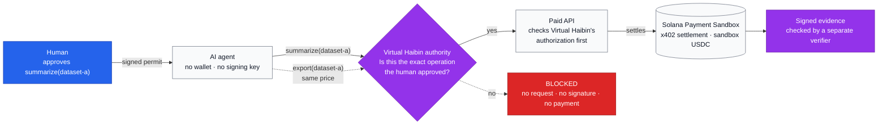
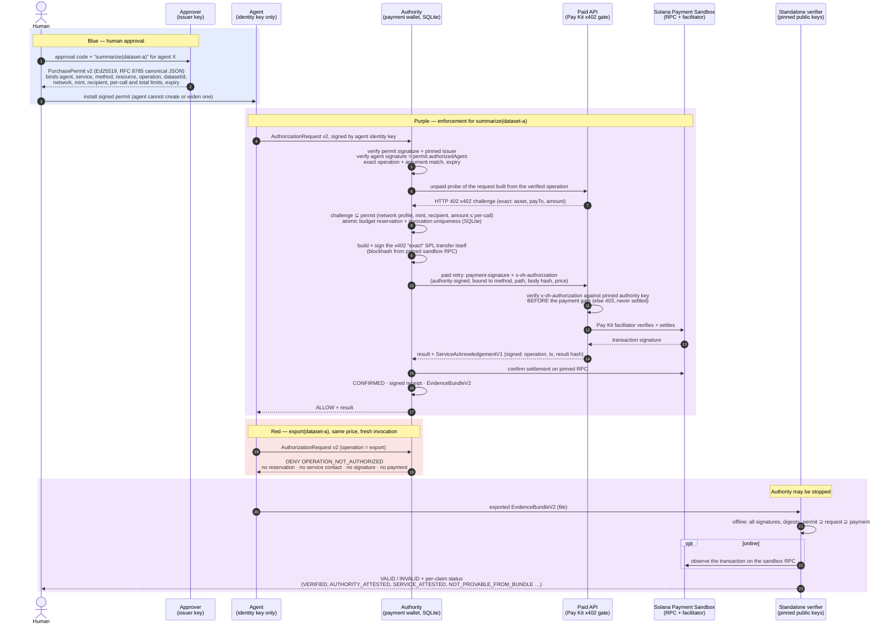
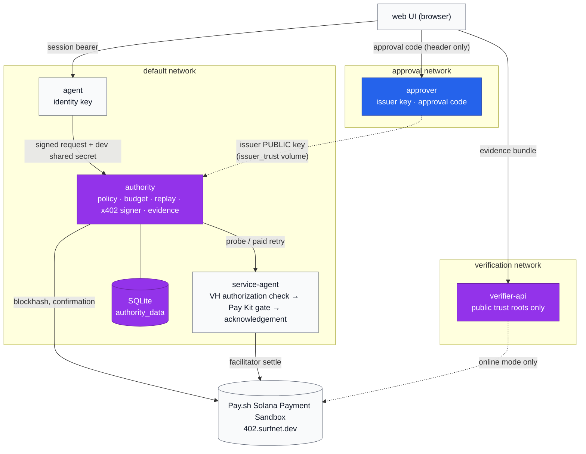

# Virtual Haibin — Architecture

Two views of the same system:

1. **Judge view.** What happens, in one picture.
2. **Developer view.** Which process holds which key and checks what, in which order.

Colours follow the CanFixIT demo UI:

- **Blue:** human approval
- **Red:** an attempted violation that is blocked
- **Purple:** Virtual Haibin enforcement and verification

> **Environment.** Settlement runs on the **Pay.sh Solana Payment Sandbox** (a hosted Surfpool test validator). The tokens there have no value. This is **not** Solana mainnet or devnet.

---

## 1. Judge view

In one sentence: the agent can ask to buy anything, but only the authority can pay. The authority pays only for the exact operation the human signed for, and the merchant refuses payment unless the authority vouched for that exact request.

---

## 2. Developer view

### Processes, keys and trust

| Process (Compose service) | Holds | Never holds |
|---|---|---|
| `approver` (own `approval` network, `127.0.0.1:4003`) | Issuer Ed25519 key and the human approval code (`approver_keys` volume) | Payment keys |
| `agent` (`:4000`) | A non-spending Ed25519 **identity** key: non-extractable, fresh per process | Any wallet or payment key, the issuer key, the RPC URL |
| `authority` (`:4002`) | x402 payment wallet (ephemeral), persistent receipt key, SQLite state (`authority_data` volume), pinned issuer and service public keys | The issuer private key |
| `service-agent` (`:4001`, mock paid API) | Its own acknowledgement key (`service_keys`), pinned authority public key, Pay Kit facilitator operator | Any Virtual Haibin private key |
| `verifier` / `verifier-online` / `verifier-api` | **Public** trust roots only (read-only) | Any private key. It has no route to the authority. |
| `web` (`:5173`) | Nothing. It holds a per-page session capability in memory only. | Keys, the approval code at rest |

### Sequence: authorized purchase, and the blocked one

### Where each check lives

### Responsibilities

| Area | Provided by | Notes |
|---|---|---|
| Payment protocol (402 challenge, `exact` scheme) | x402 v2 (`@x402/core`, `@x402/svm` 2.27.0) | Not re-implemented |
| Paid-API gate and facilitator settlement | Solana Pay Kit (`@solana/pay-kit` 0.12.0) on the Pay.sh sandbox | Not re-implemented |
| Ed25519 keys and addresses | `@solana/keys`, `@solana/addresses` (WebCrypto) | No custom crypto |
| Human permit, issuer entitlement, agent authentication | Virtual Haibin (`packages/mandate`, `apps/approver`, `apps/authority`) | |
| Semantic policy (exact operation and argument) and payment-term checks | Virtual Haibin (`packages/policy`, `apps/authority`) | Exact match only, no policy language |
| Durable budget, replay, conflict and reconciliation | Virtual Haibin (`apps/authority/src/store`, SQLite) | Single node |
| Merchant-side authorization check | Virtual Haibin (`ServiceAuthorizationV1`) + mock service | Runs before settlement |
| Evidence bundle and standalone verifier | Virtual Haibin (`packages/evidence`, `apps/verifier`) | |

More detail:

- [x402 on the sandbox](../payments-x402-sandbox.md)
- [Human approval and semantic authorization](../human-approval-and-semantic-authorization.md)
- [Evidence and verification](../evidence-and-verification.md)
- [Security and limitations](security-and-limitations.md)
